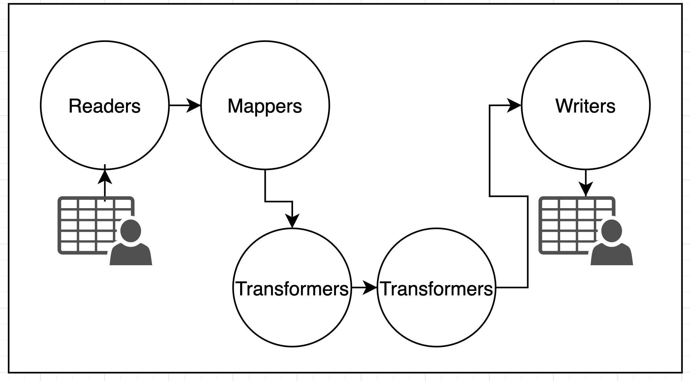

# CastorCaster
##### A open source stream transformer with a inferiority complex (:

Features: 

- Map fields from different sources as you want
- Reading and Writing interfaces that can be easily extended and hardly modified
- Dynamic transformation options of easy implementation
- "Pure PHP", approach
- Running on SOLID principles 
- Comes with unit and integration testing

####Available Readers:
* Csv - Reads csv file from file system
* HttpCsv - Reads csv format from a url

####Mappers:
* SimpleArrayMapper - does the mapping of one array containing the data 
using another with the mapping information

####Writers:
* Csv - Writes from array to Csv file
* Html - Writes from array to valid Html file

### Architecture



### Installation

Just run composer install:
```
composer install
```
Run
```
php Caster.php input.csv
```
###System configuration
```
{
  "options": {
    "default_writer": "Csv",
    "default_mapper": "SimpleArrayMapper"
  },
  "readers": {
    "Csv": {
      "mime_types": [
        "text/plain",
        "text/csv"
      ]
    }
```
####Description:

| Item        | Description           |
| ------------- |:-------------:|
| default_writer      | Default writer class used i.e: "Html" or "Csv"|
| default_mapper      | Default mapper class used i.e: "SimpleArrayMapper" or "HttpResourceMapper"|      |
| readers | List of available reader classes with their configurations   |

#####Reader configurations:
| Item        | Description           |
| ------------- |:-------------:|
| mime_types      | An array of mime_types to be mapped by readers|
| mapper (optional) | You can overwrite the default mapper using this option | 
| writer (optional)|You can overwrite the default writer using this option |

####Available Readers:
* Csv - Reads csv file from file system
* HttpCsv - Reads csv format from a url

###Mapping configuration
Simple transformation
```
{
   "to_name": "from_name"
}
```
| Item        | Description           |
| ------------- |:-------------:|
| to_name      | Name of the field after map|
| from_name      | Name of the field inside the input file|
Complex transformation
```
{
   "to_name":
     "field": "from_name",
     "transformers": {
       "transformation_one": {
         "param1": "val",
         "param2": "val",
       },
       "transformation_two": {
         "param1": "val",
       }
     }
   }
}
```
| Item        | Description   |
| ------------- |:-------------:|
| transformers      | transformations to be applied to the field|

###Available Transformers:
####Basic math
can perfom the following operations **multiply, divide, add ,subtract**

```
"basic_math": {
 "operation": "multiply"
 "factor": "4"
}
```

####Boolean from string
Transforms strings into boolean values
```
"boolean_from_string": {
 "0": "No",
 "1": "Yes"
}
```

####Replace string
Replaces a subtext of a string
```
"replace_string": {
 "search": ".",
 "to": ","
}
```

####Number from string
Transforms strings into numeric values
```
"number_from_string": {
 "1": "Male",
 "2": "Female"
}
```

####Change date format
Transforms one date format into another
```
"change_date_format": {
 "from": "d-m-Y",
 "to": "Y-m-d"
}
```